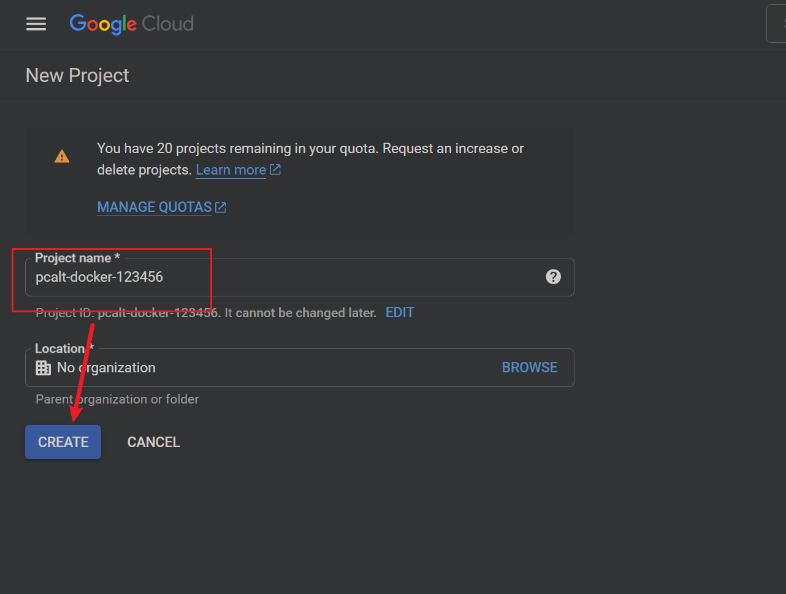
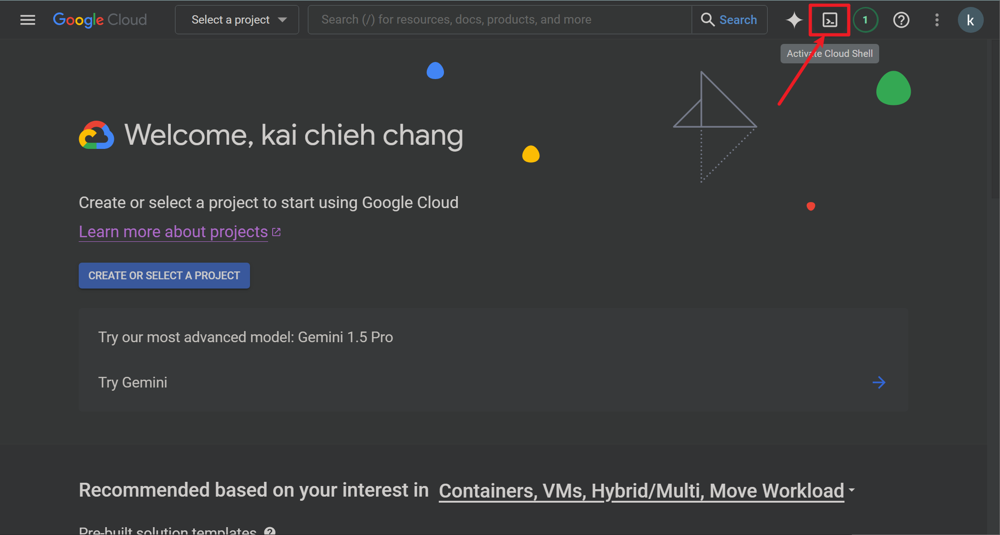
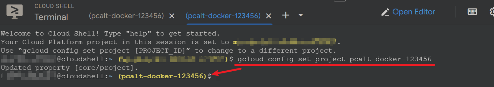
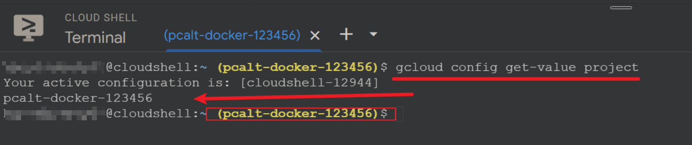

# Prerequisite


## Task 1 - Create GCP Project and set active project

1. Open a browser and navigate to GCP Console. [Google Cloud Platform](https://console.cloud.google.com/)

2. Navigate directly to [New Project](https://console.cloud.google.com/projectcreate)

3. We need to create a New GCP Project called `pcalt-docker-<員工編號>`

    for example: 
    ```
    員工編號：123456
    新增專案名稱：pcalt-docker-123456
    ```
    

4. Open `Cloud Shell`

    

5. switch the Active GCP 'ProjectID' to `pcalt-docker-<員工編號>`

    ```
    gcloud config set project pcalt-docker-123456
    ```

    

6. check Active GCP `ProjectID` again

    ```
    gcloud config get-value project
    ```

    

    ```
    pcalt-docker-123456
    ```

## Task 2 - Create virtual network and firewall rules

1. Create VPC `docker-network`

    ```
    gcloud compute networks create docker-network --subnet-mode=custom
    ```

2. Create subnet `docker-subnetwork`

    ```
    gcloud compute networks subnets create docker-subnetwork \
        --network=docker-network \
        --range=10.0.0.0/16 \
        --region=asia-east1
    ```

3. Create firewall rules

    ```
    gcloud compute firewall-rules create docker-firewall-ssh \
        --network=docker-network \
        --allow=tcp:22 \
        --source-ranges=0.0.0.0/0

    gcloud compute firewall-rules create docker-firewall-http \
        --network=docker-network \
        --allow=tcp:80,tcp:8080 \
        --source-ranges=0.0.0.0/0

    gcloud compute firewall-rules create docker-firewall-https \
        --network=docker-network \
        --allow=tcp:443,tcp:8443 \
        --source-ranges=0.0.0.0/0
    ```

## Task 3 - Create GCE in GCP and connect to VM

1. Use `use the gcloud compute instances create` command to create VM `docker-vm`:
    ```
    gcloud compute instances create docker-vm \
        --zone=asia-east1-a \
        --machine-type=e2-medium \
        --image-family "debian-11" \
        --subnet "docker-subnetwork" \
        --image-project=debian-cloud \
        --metadata=startup-script='#! /bin/bash
        
        # necessary
        sudo apt-get update
        sudo apt-get install -y apt-transport-https ca-certificates curl gnupg2 software-properties-common

        # install Docker
        curl -fsSL https://download.docker.com/linux/debian/gpg | sudo apt-key add -
        sudo add-apt-repository "deb [arch=amd64] https://download.docker.com/linux/debian $(lsb_release -cs) stable"
        sudo apt-get update
        sudo apt-get install -y docker-ce

        # install Docker Compose
        sudo curl -L "https://github.com/docker/compose/releases/download/v2.29.0/docker-compose-$(uname -s | tr A-Z a-z)-$(uname -m)" -o /usr/local/bin/docker-compose
        sudo chmod +x /usr/local/bin/docker-compose
        sudo usermod -aG docker $USER

        # Install Git
        sudo apt update && sudo apt install git -y

        EOF
        '
    ```

2. connect to VM `docker-vm`

    ```
    gcloud compute ssh docker-vm --zone=asia-east1-a
    ```


## Task 4 - Test `git`, `docker` and `docker-compose` commands

wait 1 min ~

1. for be able to run docker without `sudo`:
    ```
    sudo usermod -aG docker $USER && newgrp docker
    ```

2. check `git` version
    ```
    git --version
    ```

3. check `docker` version
    ```
    docker -v
    ```

4. check `docker compose` version
    ```
    docker compose version
    ```


## Task 5 - Git Clone codes for this hands-on in VM

```
cd ~
git clone https://github.com/HarveyChang/bi-monthly-meeting-container.git --depth=1
```
