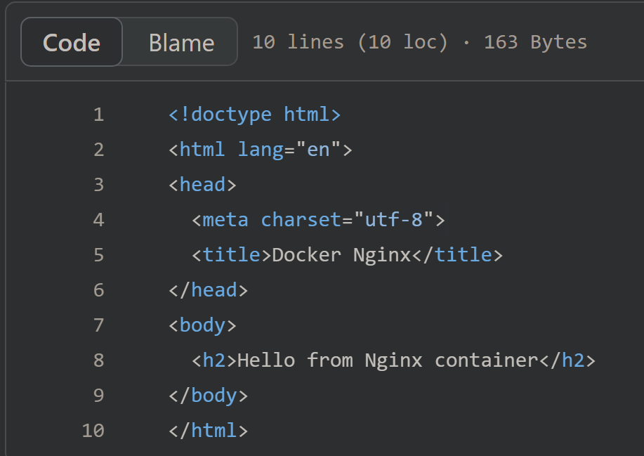
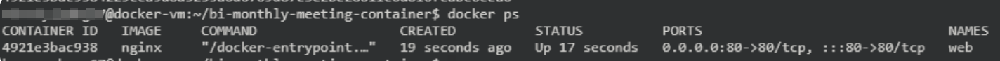
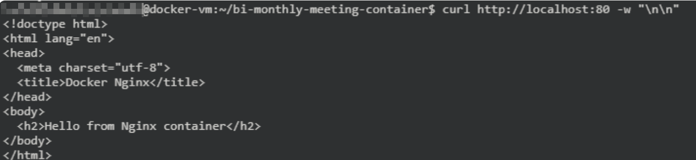
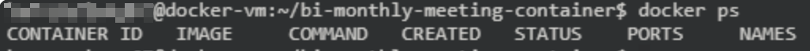

# Lab 01 - Run your first container

About Docker images:
- tag
- Dockerfile
- registries: docker hub, Nexus3,...

Layered Structure: Base Image + Layers..

Lab 說明：
在此 Lab 中將體驗一下常用的 docker commands, storage 與 network 設定。

> `TODO` add a architecture diagram


1. Prepare a html file
    
    後續我們會運用 Nginx 的 Docker image，將 [`index.html`](../site-content/index.html) 透過 web app 提供服務。`index.html` 的內容入下圖所示：

    


2. Run container with volume
    
    - `docker run`：建立 Container 並執行。
    - `--rm`：容器終止時會自動刪除。
    - `-d`：背景執行
    - `-v`：是 `--volume` 參數的簡寫，將本地的某個目錄或文件掛載到 Container 內部的一個指定目錄。
    - `--name web`：指定 Container的名字為 web
    - `-p 8080:80`：參數設定將主機的 8080 port 的流量轉發到 Container 的 80 port。

    以下將示範使用 `tag` 為 nginx image 來將掛載的 `index.html` 作為 web 首頁。

    ```
    cd ~/bi-monthly-meeting-container
    docker run --rm -d -p 80:80 --name web -v ./site-content:/usr/share/nginx/html:ro nginx
    ```

    `docker ps`: shows running containers by default.

    show running container:
    ```
    docker ps
    ```
    

    可以觀察到上一步執行的結果。

3. use `curl` to access the web page.

    ```
    curl http://localhost:80 -w "\n\n"
    ```

    

    We will observe the content of response is same as `~/bi-monthly-meeting-container/site-content/index.html`.

        
    (optional) 使用下列指令取得 VM 的 public ip 後，用瀏覽器訪問可以看到網頁顯示內容。

    ```
    curl -s ipinfo.io/ip -w "\n\n"
    ```

4. Close and delete this container.
    
    ```
    docker ps -a -q | xargs -r docker stop && docker ps -a -q | xargs -r docker rm
    ```

    - `-a` (all)：顯示所有容器，包括已停止的容器。
    - `-q` (quiet)：只顯示容器的 ID，而不包括其他詳情（如名稱、狀態、端口等）。

    這個指令是將 Container list 抓出後，分別 `docker stop` 停止 Container 與 `docker rm` 刪除本地的 Container image。

    show running container
    ```
    docker ps -a
    ```
    

    可以觀察到停止&刪除後的Container狀況。


## Questions

1. Lab 中的 Nginx container 的服務運行在 port 80，要怎麼改到 port 8080？
2. 要怎麼做才可以在 VM 上執行多個 Nginx 的 Docker Container？