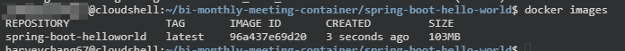

# Lab 02 - Build your first docker image

Lab 說明：
Lab 02 將延續 Lab 01 介紹 `Dockerfile`、`docker build`。

這邊我們將編譯 [Dockerfile](https://github.com/HarveyChang/spring-boot-hello-world/blob/818c4c7cea2a8c2918007b0c40d203e02fba1e26/Dockerfile) 來產生我們要的 Docker image，可以點擊 link 檢視內容。

> 也可以透過下列 cmd 來顯示 `Dockerfile` 內容：
> ```
> cat ~/bi-monthly-meeting-container/spring-boot-hello-world/Dockerfile
> ```

`Dockerfile` 內容如下：
```
FROM maven:3.5.2-jdk-8-alpine AS MAVEN_TOOL_CHAIN
COPY pom.xml /tmp/
RUN mvn -B dependency:go-offline -f /tmp/pom.xml -s /usr/share/maven/ref/settings-docker.xml
COPY src /tmp/src/
WORKDIR /tmp/
RUN mvn -B -s /usr/share/maven/ref/settings-docker.xml package

FROM openjdk:8-jre-alpine

EXPOSE 8080

RUN mkdir /app
COPY --from=MAVEN_TOOL_CHAIN /tmp/target/*.jar /app/spring-boot-application.jar

ENTRYPOINT ["java","-Djava.security.egd=file:/dev/./urandom","-jar","/app/spring-boot-application.jar"]
```

- `FROM maven:3.5.2-jdk-8-alpine`：指定 Base Image
- `COPY pom.xml /tmp/`：將 `pom.xml` 複製到 image內的 `/tmp/`
- `RUN`：在此 image 上執行命令
- `WORKDIR`：指定當前目錄
- `EXPOSE 8080`：Describe which ports your application is listening on
- `ENTRYPOINT`：定義容器的主進程


1. Build the docker image - [Dockerfile](..\spring-boot-hello-world\Dockerfile)

    ```
    cd ~/bi-monthly-meeting-container/spring-boot-hello-world
    docker build --tag 'spring-boot-helloworld' .
    ```

    show images are present locally, you can see the docker image `spring-boot-helloworld` we just bulit.
    ```
    docker images
    ```
    

2. Run container
    ```
    docker run -d -p 80:8080 spring-boot-helloworld
    ```

    show running container
    ```
    docker ps
    ```

3. Access this app.
    ```
    curl http://localhost:80 -w "\n\n"
    ```
    
    > (optional) 使用下列指令取得 VM 的 public ip 後，用瀏覽器訪問可以看到網頁顯示內容。
    > ```
    > curl -s ipinfo.io/ip -w "\n\n"
    > ```


4. Close and delete this container.
    ```
    docker ps -a -q | xargs -r docker stop && docker ps -a -q | xargs -r docker rm
    ```


## Question
1. 要怎麼進行 Docker Image 的瘦身？
2. Lab 01 的案例要怎麼修改，才可以改變執行方法不需要指定 `-v`？
    從：
    ```
    docker run --rm -d -p 80:80 --name web -v ./site-content:/usr/share/nginx/html:ro nginx
    ```
    變成：
    ```
    docker run --rm -d -p 80:80 --name web <some image>
    ```
3. 承上，兩者的差異在哪？