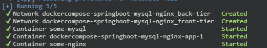
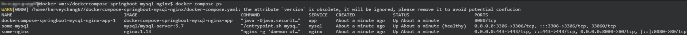
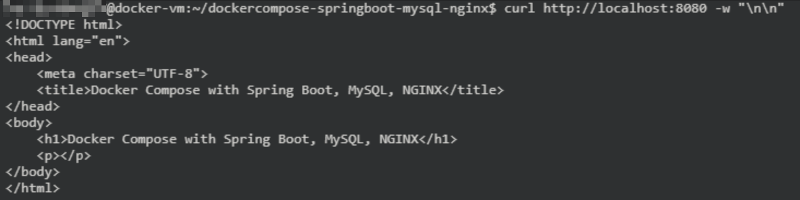
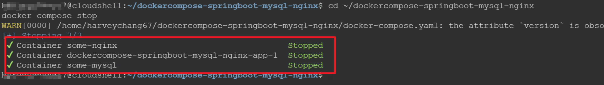

# Lab 0 3 - Docker Compose
==docker compose==
==Networking==


這邊示範的是透過 `docker-compose` 來組合多個 container。

==`TODO` add a architecture diagram==

[dc.yaml](..\dockercompose-springboot-mysql-nginx\docker-compose.yaml)

1. Run Docker Compose
    ```
    cd ~/bi-monthly-meeting-container/dockercompose-springboot-mysql-nginx
    docker compose up -d
    ```
    


2. list containers for the given docker compose configuration
    ```
    docker compose ps
    ```
    


3. Access this apps.
    ```
    curl http://localhost:8080 -w "\n\n"
    ```
    


4. Close and delete this docker compose.
    ```
    cd ~/dockercompose-springboot-mysql-nginx
    docker compose stop
    ```
    

5. list containers for the given docker compose configuration
    ```
    docker compose ps
    ```


## Clean-up: Remove GCP Compute Engine docker-vm

1. disconnect `SSH`
    ```
    `Ctrl + D` or exit
    ```

2. back to GCP Cloud Shell, remove this VM

    ```
    gcloud compute instances delete docker-vm --zone=asia-east1-a --quiet
    ```

    query info about VM
    ```
    gcloud compute instances describe docker-vm --zone=asia-east1-a
    ```

3. remove virtual network, firewall rules
    ```
    gcloud compute networks subnets delete docker-subnetwork --region=asia-east1 --quiet
    ```

    ```
    gcloud compute firewall-rules delete docker-firewall-ssh --quiet
    gcloud compute firewall-rules delete docker-firewall-http --quiet
    gcloud compute firewall-rules delete docker-firewall-https --quiet
    ```

    ```
    gcloud compute networks delete docker-network --quiet
    ```
    

