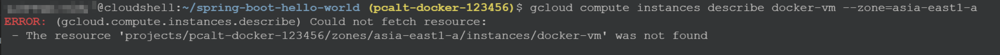

# Lab 03 - Docker Compose

這邊示範的是透過 `docker-compose` 來組合運行多個 Container。

我們準備的 [docker-compose.yaml](..\dockercompose-springboot-mysql-nginx\docker-compose.yaml) 如下：

> 也可以透過下列 cmd 來顯示 `docker-compose.yaml` 內容：
> ```
> cat ~/bi-monthly-meeting-container/spring-boot-hello-world/Dockerfile
> ```

`docker-compose.yaml` 內容如下：

```
version: '3'
services:
  nginx:
   container_name: some-nginx
   image: nginx:1.13
   restart: always
   ports:
   - 80:80
   - 443:443
   volumes:
   - ./nginx/conf.d:/etc/nginx/conf.d
   networks:
   - front-tier
   depends_on:
   - app
 
  mysql:
   container_name: some-mysql
   image: mysql/mysql-server:5.7
   environment:
    MYSQL_DATABASE: test
    MYSQL_ROOT_PASSWORD: hellokoding
    MYSQL_ROOT_HOST: '%'
   ports:
   - "3306:3306"
   restart: always
   networks:
   - back-tier  

  app:
    restart: always
    build: ./app
    networks:
    - front-tier
    - back-tier  
    depends_on:
      - mysql

networks:
  front-tier:
  back-tier:

```

- `version`：指定 Docker Compose 文件的的語法版本。
- `services`：定義應用程序的服務（容器）。此案例中包括了 3 個 Container: nginx, mysql, app。
- `container_name`：用於明確指定容器的名稱
- `build`：指定要使用的 `Dockerfile`。
- `image`：指定使用的 Docker image。
- `volumes`：用來持久化數據。
- `networks`：定義網路。
- `ports`："8080:80" 代表主機的 8080 端口映射到容器的 80 端口。
- `depends_on`：定義服務之間的依賴關係。
- `restart`：設置容器的自動重啟策略
    1. no：不自動重啟容器（默認值）。
    2. always：不管容器是否停止或崩潰，總是自動重啟容器。
    3. on-failure：僅當容器因非零退出狀態停止時才重啟（通常表示容器發生錯誤）。
    4. unless-stopped：容器在停止或崩潰後重啟，但如果手動停止則不會自動重啟。


> `TODO` add a architecture diagram


1. Run Docker Compose
    ```
    cd ~/bi-monthly-meeting-container/dockercompose-springboot-mysql-nginx
    docker compose up -d
    ```
    

    `docker compose up -d` 意思為在後台啟動所有服務。

    list containers for the given docker compose configuration
    ```
    docker compose ps
    ```
    


2. Access this apps.
    ```
    curl http://localhost:80 -w "\n\n"
    ```
    

    > (optional) 使用下列指令取得 VM 的 public ip 後，用瀏覽器訪問可以看到網頁顯示內容。
    > ```
    > curl -s ipinfo.io/ip -w "\n\n"
    > ```


3. Close and delete this docker compose.
    ```
    cd ~/dockercompose-springboot-mysql-nginx
    docker compose stop
    ```
    

    list containers for the given docker compose configuration
    ```
    docker compose ps
    ```

    若使用 `docker-compose down` 則是 停止並刪除所有容器。


## Clean-up: Remove GCP Compute Engine docker-vm

1. disconnect `SSH`

    In `SSH` session in VM, 
    
    key press `Ctrl + D` or type `exit` command.

    you will back to GCP Cloud Shell and see the Cloud Shell terminal info.
    

2. remove this VM

    ```
    gcloud compute instances delete docker-vm --zone=asia-east1-a --quiet
    ```

    query info about VM
    ```
    gcloud compute instances describe docker-vm --zone=asia-east1-a
    ```

    because this VM already removed, you will get a error msg.
    


3. remove virtual network, firewall rules
    ```
    gcloud compute networks subnets delete docker-subnetwork --region=asia-east1 --quiet
    ```

    ```
    gcloud compute firewall-rules delete docker-firewall-ssh --quiet
    gcloud compute firewall-rules delete docker-firewall-http --quiet
    gcloud compute firewall-rules delete docker-firewall-https --quiet
    ```

    ```
    gcloud compute networks delete docker-network --quiet
    ```

## (optional) Remove GCP Project

gcloud projects delete pcalt-docker-<員工編號>
```
gcloud projects delete pcalt-docker-123456
```

Prompt message:
> Your project will be deleted.
> 
> Do you want to continue (Y/n)?

keyin: Y or <Enter> button

## Questions

1. 在 `docker-compose.yaml` 中，要怎麼重複運行同一個 docker image？

2. 在 `docker-compose.yaml` 中，這個 container 可以運行嗎？

    ```
    services:
        app: 
            image: myapp:latest
    ```
