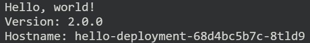
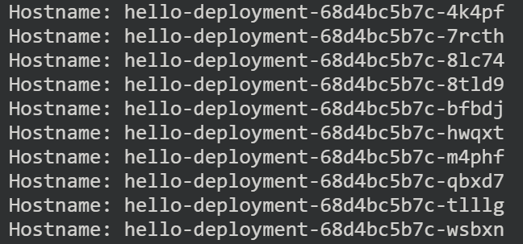

# Lab 04 - Terraform and Minikube

==change the name of VM==

## Task 1 - Install GCE via Terraform

==in GCP cloud shell==

1. initialize a Terraform workspace containing configuration files and installs plugins for required providers.

    ```
    cd ~/bi-monthly-meeting-container/GCE
    terraform init
    ```

2. constructs an execution plan
    ```
    terraform plan -out=vm-deployment
    ```

    若遇到這個錯誤訊息，請再次檢查 GCP Active Project 的設定.
    > Error: Failed to retrieve project, pid: , err: project: required field is not set

3. executes the actions proposed in a Terraform plan to create
    ```
    terraform apply vm-deployment
    ```


## Task 2 - connect to VM and start Minikube

1. connect to the new VM `terraform-vm`
    ```
    gcloud compute ssh terraform-vm --zone=asia-east1-a
    ```
2. be able to run docker without `sudo`:
    ```
    sudo usermod -aG docker $USER && newgrp docker
    ```

3. Test `git`, `docker`, `docker-compose` and `minikube` commands
    ```
    git --version
    ```

    ```
    docker -v
    ```

    ```
    docker compose version
    ```

    ```
    minikube version
    ```

4. Git Clone codes for this hands-on **in VM**
    ```
    cd ~
    git clone https://github.com/HarveyChang/bi-monthly-meeting-container.git --depth=1
    cd ~/bi-monthly-meeting-container/minikube
    ```

5. Start Minikube
    ```
    minikube start --driver=docker
    ```


## Task 3 - deploy app to Minikube

==in VM==

==add a diagram==

1. install and enable Minikube addon
    ```
    minikube addons enable ingress
    ```

2. Apply a configuration to a resource.
    ```
    kubectl apply -f deployment.yaml
    ```

3. retrive the info. of Pods
    ```
    kubectl get pod
    ```

    see only one Pod.

4. Retrive the IP address of the control panel
    ```
    minikube ip
    ```

    usually is `192.168.49.2`

5. access the App.
    ```
    curl http://192.168.49.2 -w "\n\n"
    ```
    Response:
    

    `hello-deployment-< .... >` is Pod's name

## Task 4 - scale up (manual)

1. ___
    ```
    kubectl scale deployment hello-deployment --replicas=10
    kubectl get pod
    ```
    ==snapshot==


2. ___
    run 50 times to `curl` app, 
    collect the Pod name from response.

    ```
    cd ~/bi-monthly-meeting-container/minikube
    bash ./access_app.sh
    ```

    


## Task 5 - cleanup

1. __
```
kubectl delete -f deployment.yaml
minikube stop
```

2. disconnect `SSH`
```
`Ctrl + D` or exit
```

3. __
```
cd ~/bi-monthly-meeting-container/GCE
terraform destroy -auto-approve
```

## (optional) Remove GCP Project

gcloud projects delete pcalt-docker-<員工編號>
```
gcloud projects delete pcalt-docker-123456
```